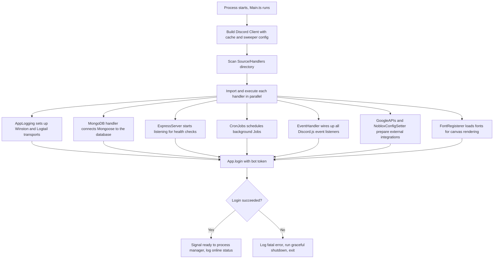
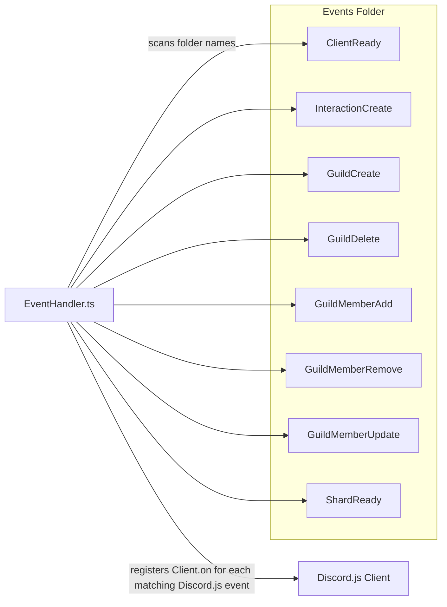
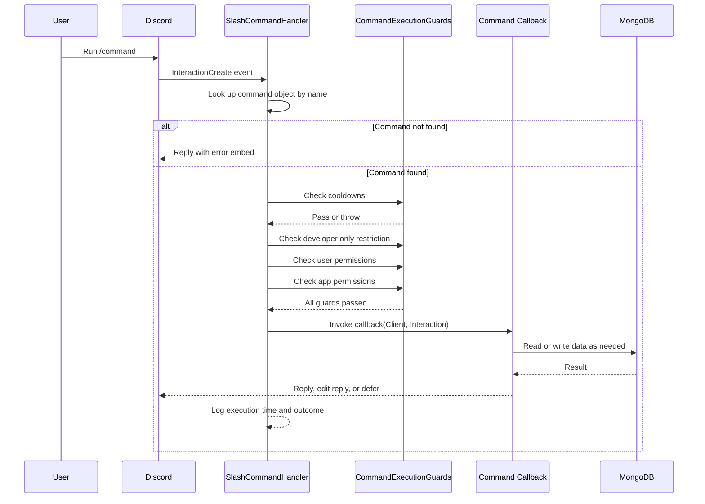
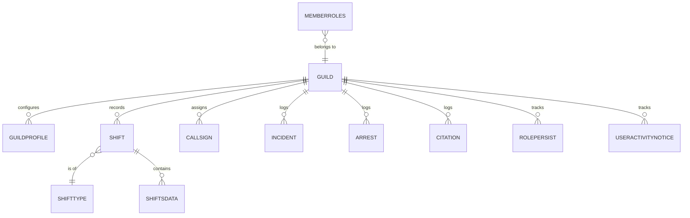
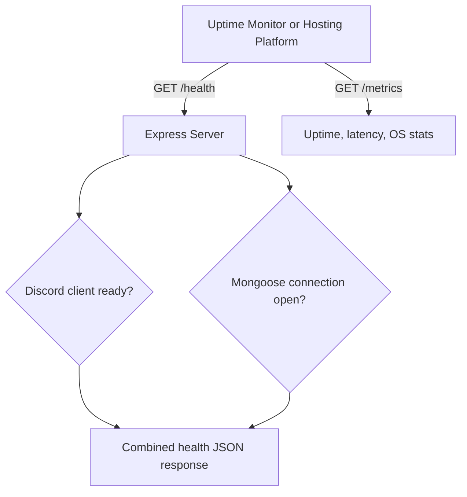
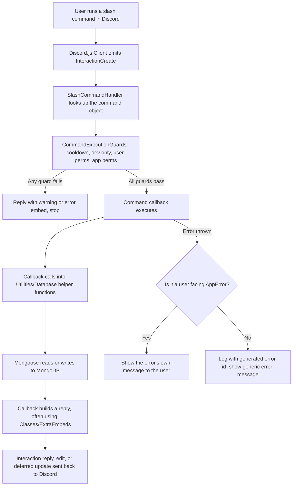

# Architecture

This document explains how the LAPD Central Discord App is put together. It covers the runtime
flow from process start to command execution, the data model, the background jobs, and the
reasoning behind a few design choices that are not obvious from just reading the code. It is
meant for anyone who wants to contribute to the project or simply understand how the pieces fit.

## 1. What This Application Is

LAPD Central is a Discord bot written in TypeScript for ER:LC LAPD themed roleplay communities. ER:LC
(Emergency Response: Liberty County) is a Roblox game, and this bot exists to support the
Discord side of the roleplay: officers clock in and out of duty, submit leave requests, get
assigned callsigns, file incident reports, and look people up through an in character "MDT"
style search tool. On top of the roleplay features, it also acts as a general purpose Discord
management bot, handling role persistence, member roles, nicknames, and per guild configuration.

The application is a single long running Node.js process. It is not a serverless function and
it is not split into microservices. One process holds the Discord client, the MongoDB
connection, the Express server for health checks, and all scheduled jobs.

## 2. Technology Stack

| Concern            | Choice                                                                             |
| ------------------ | ---------------------------------------------------------------------------------- |
| Language           | TypeScript, compiled with `tsc`, run directly in development with `tsx`            |
| Discord library    | discord.js v14                                                                     |
| Database           | MongoDB through Mongoose                                                           |
| HTTP layer         | Express, used only for health checks and metrics, not a public API                 |
| Scheduling         | node-cron based jobs under `Source/Jobs`                                           |
| Image generation   | `@napi-rs/canvas`, used for rendered cards and visual reports                      |
| External services  | Roblox API (through noblox style helpers), Google APIs (spreadsheet export)        |
| Testing            | Jest with ts-jest                                                                  |
| Process management | PM2 in production, with deploy targets for Heroku, Render, Azure, and DigitalOcean |

Module resolution uses Node's `imports` field rather than a bundler. Aliases such as
`#Source/*`, `#Utilities/*`, `#Models/*`, and `#Handlers/*` point at `Source/` during
development and at `Build/` once compiled. This keeps import paths short and stable even when
files move between folders.

## 3. Startup Sequence

Everything begins in `Source/Main.ts`. The file does four things in order: it builds the
discord.js client with specific cache and sweep settings, it loads every handler under
`Source/Handlers`, it logs in to Discord, and it reports readiness back to the process manager.

The cache and sweeper settings are worth calling out because they are a deliberate memory
control decision rather than defaults. Presence, reactions, voice state, stickers, stage
instances, and scheduled event caches are all disabled outright, since the bot does not use
them. Messages, guild members, and users are swept on a timer instead of being kept forever,
with an exception carved out for members who have an active role persist record, since removing
them from cache would defeat the purpose of that feature.

Handlers are discovered dynamically. `Main.ts` scans the `Handlers` folder, imports every file
it finds, and calls its default export with the client instance. This means adding a new startup
concern is usually just a matter of dropping a new file into that folder, rather than editing
`Main.ts` itself.

## 4. Event and Command Loading

The `EventHandler` in `Source/Handlers/EventHandler.ts` is the piece that turns a folder
structure into live Discord.js listeners. Each subfolder under `Source/Events` is named after a
Discord.js event, for example `ClientReady`, `GuildCreate`, or `InteractionCreate`. Files inside
that folder are treated as ordered steps for that event. A file can carry a numeric prefix in
brackets, such as `[0] VerifyWLGuilds.ts`, to control execution order. Files without a prefix run
after the prefixed ones, in whatever order the filesystem returns them.

This pattern shows up clearly in `ClientReady`, where four steps run in sequence right after the
bot logs in:

1. `[0] VerifyWLGuilds.ts` checks that the guilds the bot is currently in are allowed to use it.
2. `[1] VerifyDatabase.ts` confirms the database connection is healthy and guild records exist.
3. `[2] RegisterCommands.ts` compares local command definitions against what Discord has
   registered, and pushes updates only where something actually changed.
4. `[3] SynchronizeRolePersists.ts` reconciles role persistence records against real guild state.

`InteractionCreate` follows the same folder convention but fans out by interaction type instead
of a strict sequence. Files such as `SlashCommandHandler.ts`, `Autocomplete.ts`,
`CtxMenuCommandHandler.ts`, and `ModalHandler.ts` each check the interaction type they care about
and return early if it does not match, so several of them can be registered against the same
Discord.js event without stepping on each other.

## 5. Command Execution Pipeline

Slash commands live under `Source/Commands`, organized by intent rather than by technical type:
`Informative`, `Utility`, `Miscellaneous`, `Development`, and `CtxMenu` for right click context
menu commands. Each command file exports a data object describing the command along with a
callback function that runs it. During `RegisterCommands`, these objects are loaded, categorized,
and diffed against what is already deployed to Discord, so the bot only pushes changes when the
local definitions actually differ from the remote ones.

When a user runs a slash command, `SlashCommandHandler.ts` is the piece that turns the raw
interaction into an actual response. It does not just call the command's callback directly. It
runs the interaction through a series of guards first, defined in
`Utilities/Discord/CommandExecutionGuards.ts`:

1. Cooldown check, both per user and per guild, with support for a global cooldown across all
   commands.
2. Developer only command check, which blocks the command entirely for anyone who is not listed
   as an app developer.
3. User permission check, verifying the invoking member has the Discord permissions or roles the
   command requires.
4. App permission check, verifying the bot itself has the permissions it needs in that channel or
   guild before it attempts anything.

Only after all four guards pass does the callback run. Errors are caught centrally: if the
thrown error is a recognized `AppError` marked as user facing, its message is shown directly to
the user. Anything else is logged with a generated error id and a generic message is returned
instead, so internal details are never leaked to the user.

## 6. Data Model

Persistence uses MongoDB with Mongoose schemas under `Source/Models`. The schemas map closely to
roleplay concepts rather than generic Discord concepts, which reflects that this bot is
purpose built for police roleplay servers rather than being a general utility bot with roleplay
features bolted on.

Core collections:

- **Guild** and **GuildProfile** hold per server configuration: enabled modules, channel and
  role mappings, and settings for each feature.
- **Shift**, together with the `ShiftDurations`, `ShiftType`, and `ShiftsData` schemas, tracks
  duty sessions. This is the backbone of the activity and duty tracking features.
- **Arrest**, **Citation**, and **Incident** store roleplay records created by officers during
  play, used for reporting and lookup through the MDT commands.
- **Callsign** tracks assigned callsigns per member per guild.
- **MemberRoles** and **RolePersist** track role state so it can be restored if a member leaves
  and rejoins, or reconciled if it drifts from what the bot expects.
- **UserActivityNotice** models leave of absence and reduced activity requests.

Database access is not spread freely through command files. Helper modules under
`Utilities/Database` wrap common read and write patterns, such as `UserHasPermissions.ts` and
`RolePersists.ts`, so command callbacks call into a small set of well tested functions instead of
writing Mongoose queries inline everywhere. This keeps query logic in one place and makes it
easier to change how a feature is stored without touching every command that uses it.

## 7. Background Jobs

`Source/Jobs` contains scheduled work that runs independently of any user interaction, wired up
through `Handlers/CronJobs.ts` at startup. These jobs exist because roleplay data has a natural
lifecycle: shifts end, leave requests expire, callsigns need to be reclaimed, and old records
need to be cleaned out for storage and privacy reasons.

| Job                               | Purpose                                                                           |
| --------------------------------- | --------------------------------------------------------------------------------- |
| `AppWatchdog.ts`                  | Periodic self check of the application's own health                               |
| `AutodeleteDutyActivitiesLogs.ts` | Removes old duty activity logs past their retention window                        |
| `AutodeleteRolePersistRecords.ts` | Clears stale role persistence records                                             |
| `CallsignAutomations.ts`          | Handles automatic callsign related actions on a schedule                          |
| `CheckForExpiredUANotices.ts`     | Finds leave or reduced activity notices that have expired and updates their state |
| `ScheduledGuildDataDeletion.ts`   | Deletes guild data after the bot has been removed for a defined period            |
| `ScheduledUserDataDeletion.ts`    | Deletes a specific user's data on request, supporting data privacy requirements   |

The presence of explicit user and guild data deletion jobs is a deliberate privacy conscious
choice, not an afterthought. Because the bot stores roleplay records tied to real Discord users,
having a controlled and scheduled deletion path matters for compliance and for user trust.

## 8. HTTP Layer

The Express server in `Handlers/ExpressServer.ts` is intentionally small in scope. It is not a
REST API for the bot's features. Its only job is exposing operational endpoints:

- `GET /health` returns overall status covering both Discord connectivity and database
  connectivity.
- `GET /health/discord` and `GET /health/database` return the status of each dependency
  individually.
- `GET /metrics` exposes uptime, latency, and system level metrics.
- `GET /` and `GET /favicon.ico` handle basic requests so the endpoint does not look broken to a
  monitoring service.

Requests are rate limited to 60 per minute per IP address using `express-rate-limit`. This server
exists mainly so external uptime monitors and hosting platforms such as Render or Azure Web Apps
can confirm the process is alive and its dependencies are reachable, which is also why the
project ships health check based deploy configurations for several hosting providers rather than
committing to just one.

## 9. Utilities Layer

`Source/Utilities` is the largest folder in the project by file count, and it is organized by
concern rather than by feature, which keeps shared logic reusable across unrelated commands:

- **Classes** holds core building blocks such as `AppLogger`, `AppError`, and embed builder
  classes used everywhere replies are sent.
- **Database** wraps Mongoose access patterns described in section 6.
- **Discord** contains Discord specific helpers, including the command execution guards and
  command registration comparison logic.
- **External** and **Roblox** wrap third party API calls, keeping HTTP and authentication
  details out of command files.
- **ImageRendering** and **Reports** generate the canvas based cards and exported reports used by
  several commands.
- **Autocompletion** supplies the logic behind command option autocomplete.
- **Helpers** and **Strings** hold small general purpose functions, including the in memory
  caches used for cooldowns and active user tracking.

The goal of this layering is that a command file should mostly read as orchestration: check
input, call a utility or database function, build a reply. The actual business logic and error
handling patterns live in the utilities layer where they can be tested and reused.

## 10. Configuration and Secrets

Configuration is split between `Constants.ts`, `Shared.ts`, and `Secrets.ts` under
`Source/Config`. `Secrets.ts` is not committed to the repository. Contributors copy
`Secrets.example.ts` to create it locally, and the CI workflow generates a version of it from
environment variables and safe fallback values before running tests. This keeps real credentials
out of the codebase while still letting the test suite and type checker run against a complete
configuration shape.

## 11. Testing

Tests live under `Tests`, split into `Components`, `Utils`, and `Other`, and run with Jest using
ts-jest for TypeScript support. The split mirrors the source layout: utility functions are
tested in isolation under `Utils`, while `Components` covers more integrated pieces. CI runs the
full suite on both Ubuntu and Windows, which matters given the project intentionally uses CRLF
line endings and Windows flavored formatting conventions, so behavior needs to be verified on
both platforms rather than assumed.

## 12. Design Choices Worth Noting

A few decisions in this codebase are not accidents and are worth calling out directly for anyone
extending it:

**File based discovery over central registries.** Both events and handlers are discovered by
scanning folders rather than being imported and listed by hand somewhere. This lowers the friction
of adding new features, since a contributor mostly needs to know the folder convention rather than
edit a central file, at the cost of making the full picture of "what runs" less visible from a
single file. This document exists partly to make up for that.

**Numeric ordering prefixes instead of a dependency graph.** Rather than building a formal task
dependency system for startup steps, the project uses simple bracketed numeric prefixes in
filenames. This is easy to reason about for a small number of ordered steps, such as the four
`ClientReady` steps, though it would not scale well to a much larger number of interdependent
steps.

**Guard pipeline before every command callback.** Cooldowns, developer restrictions, and
permission checks are enforced centrally in the interaction handler rather than being repeated
inside each command. This avoids an entire class of bugs where a command forgets a permission
check, since the check happens before the callback is ever reached.

**Cache and sweep tuning at the client level.** Disabling caches for data the bot never reads,
such as presence and reactions, and sweeping members and users on a timer, keeps memory usage
predictable as the bot joins more guilds, at the cost of needing an explicit exception for role
persistence so that feature is not broken by an overly aggressive sweep.

**Scheduled deletion as a first class feature.** Data retention and deletion are handled by
dedicated jobs rather than left as a manual or one off task, which matters because this bot
stores roleplay activity tied to real people.

## 13. Request Lifecycle, End to End

The diagram below ties the previous sections together into a single path for a typical duty
related slash command, from the moment a user presses enter to the point where a database record
exists.

