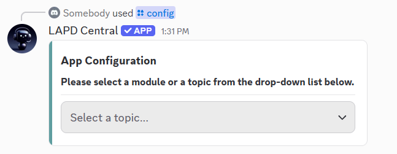
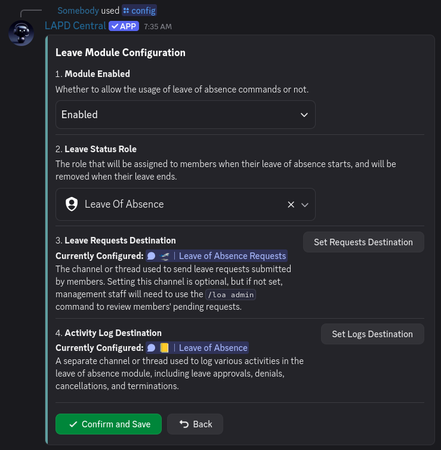
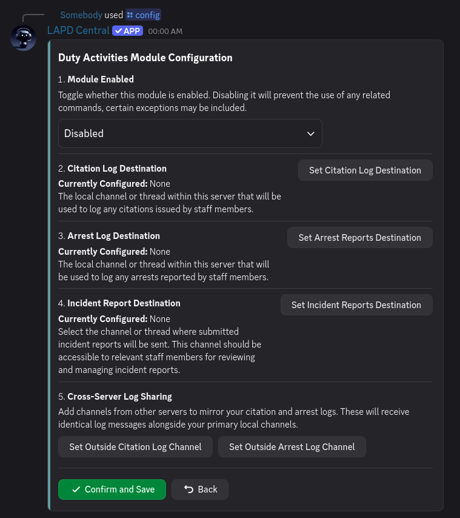
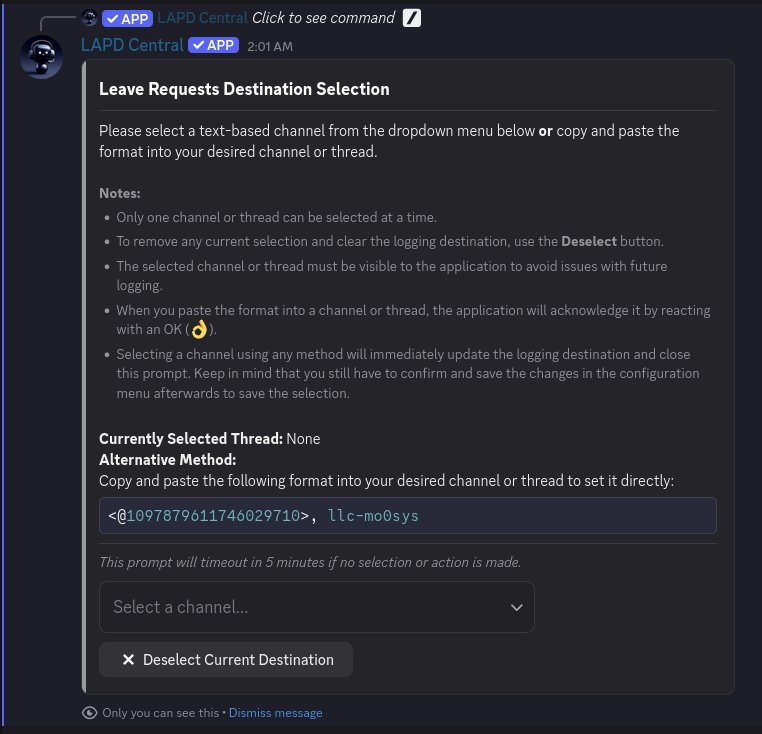

# App Configuration

The application can be configured directly using the [`/config`](application-commands.md#utility-and-miscellaneous-commands) slash command.\
You’ll be prompted to select a module (feature combination) to enable or customize, with in-app guidance and detailed explanations provided at each step, setting, or prompt.

As a result, there’s no need to repeat all configuration details on this page — most settings are self-explanatory within the interface itself. Thank you for your understanding.

> _“The best documentation is the one you don't need.”_ — _(some developer's wisdom)_



<figure><picture><source srcset="../../.gitbook/assets/config-selection-dark.png" media="(prefers-color-scheme: dark)"></picture><figcaption>
Configuration Topic/Module Selection
</figcaption></figure>








<figure><figcaption>
Leave of Absence Module Configuration
</figcaption></figure>




<figure><figcaption>
Duty Activities Module Configuration
</figcaption></figure>



<figure><figcaption>
Destination Channel Selection for Leave Requests
</figcaption></figure>


