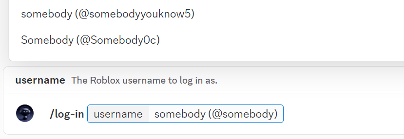

# Linking a Roblox Account

Linking your Roblox account to the application simplifies executing commands that require Roblox information, such as signing a reported arrest with the `/log arrest` command, by eliminating the need to enter your Roblox ID, username, or display name each time.

This guide summarizes the account linking process through the application.

## 1. Executing the Login Command

First of all, open any server channel where the application is installed and available within and then execute the `/log-in` slash command, then enter the Roblox username to link

If your Roblox account is already linked and verified using BloxLink integration, the application will automatically complete verification if applicable—no need to modify your profile About section or enter sample text. You will see the success response immediately (see Figure 4).

<figure><picture><source srcset="../../.gitbook/assets/login-cmd-execution-dark.png" media="(prefers-color-scheme: dark)"></picture><figcaption>
Figure 1: executing “/log-in” slash command with a username.
</figcaption></figure>

<figure><picture><source srcset="../../.gitbook/assets/login-cmd-manual-prompt-dark.png" media="(prefers-color-scheme: dark)"></picture><figcaption>
Figure 2: ephemeral login prompt with “Verify and Login,” “Cancel Login,” and “Profile Link.”
</figcaption></figure>

## 2. Modifying Profile Description to Include the Sample Text

The app shows an ephemeral login prompt containing a random sample text; copy it, open the Profile link from the prompt, paste it anywhere within the profile’s About[^1], and press Save (see Figures 2, 3).

<figure><picture><source srcset="../../.gitbook/assets/login-cmd-profile-desc-editing-dark.png" media="(prefers-color-scheme: dark)"></picture><figcaption>
Figure 3: editing the Roblox profile About with the sample text.
</figcaption></figure>


Some considerations:

* It is not required to completely replace your current profile description but only include the sample text in it. Once you include it and save changes, you may move to the [third step](linking-a-roblox-account.md#id-3.-verifying-and-linking-the-account) described below.
* Roblox may filter or transform text for safety, which can change or remove the sample text; if that happens, rerun the command to generate a new sample and try again.
* This prompt is private and may expire; complete within a few minutes to avoid restarting.


## 3. Verifying and Linking the Account

Return to the prompt and press “Verify and Login” green button to complete verification; the app checks the profile for the exact sample text and links the account if found (see Figures 2, 4).

On success, a confirmation response appears and can be safely dismissed; ephemeral prompts are only visible to the invoker and may disappear after a short time (see Figure 4).

<figure><picture><source srcset="../../.gitbook/assets/login-cmd-success-dark.png" media="(prefers-color-scheme: dark)"></picture><figcaption>
Figure 4: the success response.
</figcaption></figure>


After linking succeeds, remove the sample text from the profile About if desired; it is no longer needed for the application.


[^1]: Also called Description.
