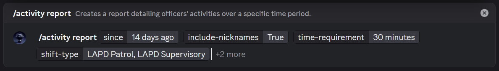

# Sheets Activity Report

## **Overview**

**LAPD Central** allows you to generate **Google Sheets-based activity reports** that summarize staff members’ performance over a specific time period. These reports include:

* Total on-duty time;
* Number of arrests made;
* Arrests assisted;
* Citations issued;
* Incident reports filed; in addition to
* A separate sheet dedicated for overall statistics. 

To generate a report, simply run the `/activity report` slash command and fill in the options as needed.

***

## Command Options Explained

* **Since** _(Required)_\
  The start of the time range for the report. This can be a specific date (e.g., `May 15, 2025`) or a relative expression (e.g., `7 days ago`, `last Monday`, `January 1`).
* **To** _(or Until)_\
  Sets the end of the time range. If omitted, the report will include data from the selected `since` date up until the moment the command is executed.
* **Time Requirement**\
  Also referred to as the **shift quota**. This sets the minimum required on-duty time for someone to be considered as having met their quota. A green checkmark is present in the report for those who met their quota.
  * If left empty, the default configured quota (from your app settings) will be used.
  * If no default is set, the report will not enforce a quota.
* S**hift Type**\
  Restricts the report to one or more shift types. Only staff permitted to use the selected shift types will be included. You may separate multiple shift types with commas.\
  Examples: `LAPD Patrol`, `LAPD Patrol, LAPD Metro`
* **Include Nicknames**\
  Whether to display server nicknames (with fallback to global display names) in the final report. Useful for teams that use unique designations or require clearer identification or event to simplify the identification of specific member.
* **Private** _(or Private Response)_\
  If set to `true`, the report response will be sent only to you. Use this if you prefer to test the report output or want to keep the data private. Notice that the generated Google Sheet is **read-only**. To modify or use interactive features, use **`File > Make a copy`**.

***

## Throughout Guide



#### Type in the slash command with the options you want.

<figure><figcaption>
Activity Report Command
</figcaption></figure>



#### Wait until the report is successfully generated.

<figure><figcaption>
Report Being Created Response
</figcaption></figure>



#### Done! All you have to do now is to click (or press) the `View Activity Report` button to open the report on Google sheets.

Sample report: [https://docs.google.com/spreadsheets/d/1RS\_Szv3eesVk-QzB8aV3Uio6hzaE8fS6FCWqH0GjUnM](https://docs.google.com/spreadsheets/d/1RS_Szv3eesVk-QzB8aV3Uio6hzaE8fS6FCWqH0GjUnM/edit?usp=sharing)

<figure><figcaption>
Report Created Response
</figcaption></figure>



